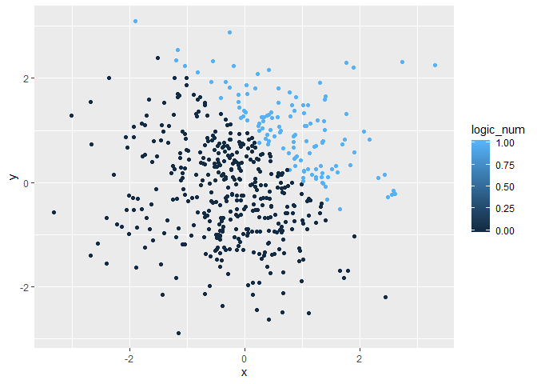
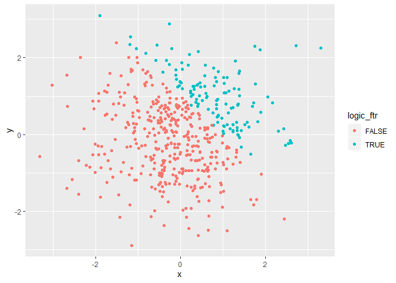

p8105\_hw1\_zz2603
================
Ziyi Zhao
9/16/2019

``` r
set.seed(100)

## set four variables in data frame
rand_norm <- rnorm(8)
log_vec <- rand_norm>0
char_vec <- c("husky","Akita","Shiba Inu","Alaska","Samoyed","Pekingese",
              "British Blue Cat","Orange Cat")
level_vec <- c("Low","High","High","Low","Low","Mid","Mid","Mid")%>%factor()

## combine them together and create a new data frame
prob1_df <- tibble(rand_norm,log_vec,char_vec,level_vec)
prob1_df
```

    ## # A tibble: 8 x 4
    ##   rand_norm log_vec char_vec         level_vec
    ##       <dbl> <lgl>   <chr>            <fct>    
    ## 1   -0.502  FALSE   husky            Low      
    ## 2    0.132  TRUE    Akita            High     
    ## 3   -0.0789 FALSE   Shiba Inu        High     
    ## 4    0.887  TRUE    Alaska           Low      
    ## 5    0.117  TRUE    Samoyed          Low      
    ## 6    0.319  TRUE    Pekingese        Mid      
    ## 7   -0.582  FALSE   British Blue Cat Mid      
    ## 8    0.715  TRUE    Orange Cat       Mid

``` r
## see mean of four variable
mean(pull(prob1_df,rand_norm)) ## it works!
```

    ## [1] 0.1256937

``` r
mean(pull(prob1_df,log_vec)) ## it also works!
```

    ## [1] 0.625

``` r
mean(pull(prob1_df,char_vec)) ## it does not work and returns NA
```

    ## Warning in mean.default(pull(prob1_df, char_vec)): argument is not numeric
    ## or logical: returning NA

    ## [1] NA

``` r
mean(pull(prob1_df,level_vec)) ## it does not work and returns NA
```

    ## Warning in mean.default(pull(prob1_df, level_vec)): argument is not numeric
    ## or logical: returning NA

    ## [1] NA

Only mean of numeric and logical vectors return the numeric result.
However, the other two vector, in character and factor, return NA.

``` r
log_num <- as.numeric(log_vec)
log_num
```

    ## [1] 0 1 0 1 1 1 0 1

``` r
char_num <- as.numeric(char_vec)
```

    ## Warning: NAs introduced by coercion

``` r
char_num
```

    ## [1] NA NA NA NA NA NA NA NA

``` r
fac_num <- as.numeric(level_vec)
fac_num
```

    ## [1] 2 1 1 2 2 3 3 3

As we transfer logical vector into numeric vector, all values (“True”
and “False”) are tranferred to 1 and 0. This is why we get numeric value
when we apply mean function to logical vector. All values in character
vector are transferred into NA when we tried to convert non-numeric
character into numeric values. This is why mean function return NA. When
we converted the factor vector into numeric value, three levels are
converted into numeric values 1,2 and 3. However, mean of factor vector
return NA. I think the reason is that all values in factor vector are
non-numeric.

``` r
## in last chunk, we convert log_vec into numeric vector log_num
logNumRD <- log_num*rand_norm 
logNumRD
```

    ## [1] 0.0000000 0.1315312 0.0000000 0.8867848 0.1169713 0.3186301 0.0000000
    ## [8] 0.7145327

``` r
logFacRD <- as.factor(log_vec)*rand_norm ## multiplying seems quite useless
```

    ## Warning in Ops.factor(as.factor(log_vec), rand_norm): '*' not meaningful
    ## for factors

``` r
logFacRD
```

    ## [1] NA NA NA NA NA NA NA NA

``` r
logFacNumRD <- (as.factor(log_vec)%>%as.numeric())*rand_norm
logFacNumRD
```

    ## [1] -0.50219235  0.26306233 -0.07891709  1.77356962  0.23394254  0.63726018
    ## [7] -0.58179068  1.42906542

``` r
x <- rnorm(500)
y <- rnorm(500)
logic_vtr <- (x+y)>1
logic_num <- as.numeric(logic_vtr)
logic_ftr <- as.factor(logic_vtr)

plot_df <- tibble(x,y,logic_vtr,logic_num,logic_ftr)
plot_df
```

    ## # A tibble: 500 x 5
    ##          x       y logic_vtr logic_num logic_ftr
    ##      <dbl>   <dbl> <lgl>         <dbl> <fct>    
    ##  1 -0.825  -0.576  FALSE             0 FALSE    
    ##  2 -0.360   0.407  FALSE             0 FALSE    
    ##  3  0.0899 -0.0453 FALSE             0 FALSE    
    ##  4  0.0963  0.441  FALSE             0 FALSE    
    ##  5 -0.202   2.24   TRUE              1 TRUE     
    ##  6  0.740  -0.586  FALSE             0 FALSE    
    ##  7  0.123   0.599  FALSE             0 FALSE    
    ##  8 -0.0293  1.27   TRUE              1 TRUE     
    ##  9 -0.389  -0.912  FALSE             0 FALSE    
    ## 10  0.511  -1.38   FALSE             0 FALSE    
    ## # ... with 490 more rows

  - the number of row of dataset is 500
  - the number of columes of dataset is 5.
  - the mean of x is -0.0406178.
  - the median of x is -0.0656534.
  - the standard deviation 1.0151934.
  - the proportion of cases for logical vector is 0.246.

<!-- end list -->

``` r
plot1 <- ggplot(plot_df, aes(x=x,y=y,color=logic_vtr))+geom_point()
plot1
```

<!-- -->

``` r
plot2 <- ggplot(plot_df, aes(x=x,y=y,color=logic_num))+geom_point()
plot2
```

<!-- -->

``` r
plot3 <- ggplot(plot_df, aes(x=x,y=y,color=logic_ftr))+geom_point()
plot3
```

<!-- -->

``` r
ggsave(plot1, file="hw1plot1.pdf")
```

    ## Saving 7 x 5 in image
